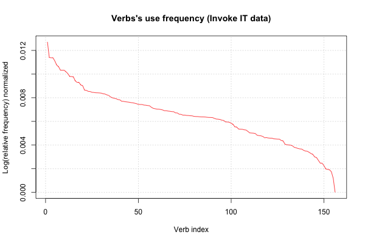

# freq-verb
Compute frequency of use of irregular engish verbs. Data set for ["A list of verbs"][1] iOS App.

The fequency word data comes from <http://invokeit.wordpress.com/frequency-word-lists/>

## Dependencies

* [unicodecsv][2] for writing CSV files with UTF-8 encoded strings
* [R][3] to generate the graphs in this document and to analize the data

## Results

The 5 more frequently used verbs are:

|Verb                  |     Freq |
|:--------------------:|---------:|
| be/am/are/is         | 0.225649 |
| get                  | 0.071703 |
| do/does              | 0.070281 |
| have                 | 0.069897 |
| come                 | 0.055208 |

As you can see the verb **To Be** is very predominant, perhaps to much. We can explore the distribution to see how are distributed all the sample

As we intend to use a scroller to select the number of verbs in function of frequency of use, this kind of stepped distribution isnt' very usefull. Usually in this cases we use a logaritmic one (normalized between 0.0 and 1.0)

This will be the data that we use in owr [project][1]

[1]:https://github.com/rbarbera/irregularverbs
[2]:https://github.com/jdunck/python-unicodecsv
[3]:http://www.R-project.org